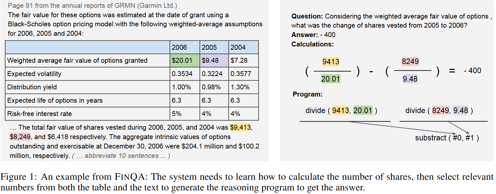

# NumReasoning4VietnameseFinancialText

Numerical reasoning question answering over Vietnamese financial documents,
built for the **VLSP 2025 Numerical Reasoning QA (NumQA)** shared task.

Given a financial document (text passages + a table) and a natural-language
question, the goal is to generate an executable **computation program** (a
sequence of arithmetic/table operators) that derives the correct numerical
answer — not just the answer itself. This makes every prediction auditable:
a wrong-but-lucky answer with a broken program is worth less than a
transparent, verifiable reasoning path.

## Task definition



- **Input**: `pre_text` (paragraphs before a table), `table`, `post_text`
  (paragraphs after), and a Vietnamese `question`.
- **Output**: a `program` string using 10 operators —
  `add`, `subtract`, `multiply`, `divide`, `exp`, `greater`,
  `table_sum`, `table_average`, `table_max`, `table_min` — where later steps
  can reference earlier results via `#0`, `#1`, etc.
  (e.g. `subtract(9829, 642), divide(#0, 642)`).
- **Metrics** (following the FinQA/VLSP 2025 protocol):
  - **Execution Accuracy (EA)** — does executing the program produce the
    gold numeric answer?
  - **Program Accuracy (PA)** — does the program structurally match the gold
    program (same operators/args/order, after normalization)? This is the
    stricter, primary metric for the task, since a correct-by-coincidence
    program is not actually trustworthy reasoning.

See `papers/` for the shared task description, the original FinQA paper this
task's format is based on, and a program-centric policy optimization paper
used as a reference for the SFT+GRPO stage.

## Dataset — ViNumQA

`datasets/ViNumQA/`:

| File | Samples | Notes |
|---|---|---|
| `train.json` | 2,993 | gold `program` + `exe_ans` provided |
| `valid.json` | 584 | gold `program` + `exe_ans` provided |
| `test.json` | 497 | public test set, gold provided (for local eval) |
| `private_test.json` | 1,625 | **no gold** — held out for leaderboard scoring |
| `train_with_reasoning_trace.json` | 2,905 | `train.json` + distilled `qa.reasoning_trace` field (see below) |
| `valid_with_reasoning_trace.json` | 571 | same, for `valid.json` |

Each entry: `{pre_text, table, post_text, id, qa: {question, program, exe_ans}}`.
Unlike the original English FinQA, this dataset does **not** include a
`program_re` field (alternative valid programs for the same question), so no
program-diversity augmentation from that source is available here.

## Repository layout

```
notebooks/vinumqa/
├── 0-shot/                        0-shot prompting baselines
├── 1-shot/                        1-shot prompting baselines
├── few-shot/                      3-shot prompting baselines
├── distill-reasoning-trace/       teacher (Qwen3-Next-80B) → reasoning trace generation
├── sft-wo-reasoning-trace-distill/  QLoRA SFT, program-only labels (no trace)
├── sft-w-reasoning-trace-distill/   QLoRA SFT, distilled-reasoning-trace labels
└── sft-grpo/                      (planned) SFT + GRPO policy optimization stage
notebooks/translated-finqa/        (placeholder) planned baselines on the translated-FinQA subset
datasets/ViNumQA/                  dataset splits (see table above)
papers/                            reference papers (task description, FinQA, PCPO)
```

Every prompting/SFT notebook shares the same `SYSTEM_MESSAGE` (operator list +
formatting rules), the same `pre_text`/`table`/`post_text`/`question` context
formatting (table rendered as GitHub-flavored markdown via `tabulate`), and
the same program parser/PA/EA scorer, so results are directly comparable
across models and methods.

## Methodology

### 1. Prompting baselines (0-shot / 1-shot / few-shot)

Zero, one, and three in-context examples, evaluated across multiple models
(local Qwen3-4B, API models via an OpenAI-compatible endpoint, and
`gpt-5-nano` via the OpenAI Batch API — 50% cheaper than sync calls, used
since these are offline full-test-set scoring runs rather than live serving).
The 1-shot exemplar is drawn from the VLSP 2025 paper's own Figure 1 example;
the 3 few-shot exemplars are hand-picked from `train.json`, one per evidence
category (Table Only / Text Only / Table & Text) matching the paper's own
question-type breakdown.

### 2. QLoRA SFT — no reasoning trace

`sft-wo-reasoning-trace-distill/qwen3-4b-stf-wo-reasoning-trace.ipynb`: fine-tunes
Qwen3-4B (4-bit + LoRA via Unsloth) to map context+question directly to the
gold program string, with loss masked to the assistant turn only
(`train_on_responses_only`). No synthesized or distilled reasoning trace —
this is the plain-label baseline to compare reasoning-augmented training
against.

### 3. Reasoning-trace distillation (CoNR) + SFT with reasoning

Rather than hoping the student model discovers good reasoning on its own, we
distill it from a stronger teacher, following the reasoning-distillation
approach used by the top VLSP 2025 teams (see `papers/`):

1. **Teacher**: `Qwen3-Next-80B-A3B-Thinking`, served via vLLM.
2. **CoNR prompt** (`distill-reasoning-trace/qwen3-next-80b-conr-trace-gen.ipynb`):
   the teacher is given the context/question **plus the verified gold
   program and answer**, and asked to write a natural-language reasoning
   trace that arrives at *exactly* that program — backward rationalization,
   not independent problem-solving. This guarantees every kept trace is
   grounded in a correct label, and the prompt explicitly forbids the trace
   from admitting it was told the answer (denylist-checked afterwards).
3. **Validation before trusting a trace**: the generated `<program>` is
   parsed and compared to gold via **exact structural match** (not just
   execution-equivalence) using the same parser as every other notebook;
   traces are discarded if the program doesn't match, or if a denylist check
   catches "as given"/"chương trình được cho là"-style leakage.
4. **Results**: validated first on two 150-sample trials (92.0% → 98.0% exact
   match after fixing a parser bug and a `<think>`-tag extraction bug — see
   the notebook's intro cell for detail), then run at full scale:
   **98.1%** exact match on `train.json` (2,993 samples), **99.0%** on
   `valid.json` (584 samples). Nearly all residual mismatches were traced
   back to actual errors in the gold dataset itself (missing parens, wrong
   table column/row referenced, a gold program whose direction contradicts
   its own question wording) rather than teacher-model or pipeline error —
   in several cases the teacher's answer was verifiably *more* correct than
   the provided gold label.
5. **Clean data → `train_with_reasoning_trace.json` / `valid_with_reasoning_trace.json`**:
   only exact-match, non-leaking traces are kept (2,905 / 571 samples). All
   other fields (`program`, `exe_ans`, `pre_text`, `table`, `post_text`,
   `id`) come directly from the original dataset, unmodified — only
   `qa.reasoning_trace` is new, and every kept sample was index/content
   cross-checked against the source file (0 mismatches).
6. **SFT with reasoning** (`sft-w-reasoning-trace-distill/qwen3-4b-stf-w-reasoning-trace.ipynb`):
   same QLoRA setup as the no-reasoning baseline, but the assistant turn is
   now `{reasoning_trace}\n</think>\n\n{program}` with `enable_thinking=True`
   — matching how Qwen3-Next-Thinking's own outputs are structured (no
   literal opening `<think>` tag; the chat template inserts it after the
   assistant tag itself).

### 4. SFT + GRPO (planned)

`notebooks/vinumqa/sft-grpo/` — reward function combining program validity,
execution correctness, and conciseness (following the program-centric policy
optimization approach in `papers/`), to further refine the SFT model beyond
supervised imitation. Not yet implemented.

## Results (test.json, 497 samples)

| Method | Model | PA | EA |
|---|---|---|---|
| 0-shot | Qwen3-4B | 0.0000 | 0.0644 |
| 0-shot | Llama-3.3-70B-Instruct | 0.1730 | 0.4085 |
| 0-shot | DeepSeek-V4-Flash | 0.2797 | 0.4487 |
| 0-shot | gpt-5-nano (medium effort) | 0.1831 | 0.2958 |
| 1-shot | Qwen3-4B | 0.1449 | 0.3159 |
| 1-shot | Llama-3.3-70B-Instruct | 0.2958 | 0.4567 |
| 1-shot | DeepSeek-V4-Flash | 0.3259 | 0.4989 |
| 1-shot | gpt-5-nano (medium effort) | 0.3179 | 0.4346 |
| few-shot (3) | Qwen3-4B | 0.3159 | 0.4487 |
| few-shot (3) | Llama-3.3-70B-Instruct | 0.3099 | 0.4527 |
| few-shot (3) | DeepSeek-V4-Flash | 0.3421 | 0.4909 |
| few-shot (3) | gpt-5-nano (low effort) | 0.3622 | 0.4648 |
| QLoRA SFT (no reasoning trace) | Qwen3-4B | 0.6419 | 0.6439 |
| QLoRA SFT (w/ distilled reasoning trace) | Qwen3-4B | *in progress* | *in progress* |
| SFT + GRPO | Qwen3-4B | *planned* | *planned* |

PA/EA are computed with the same exact-match/tolerance-based scorer used
across every notebook (`extract_program` → `parse_program` →
`compute_program_accuracy` / `compute_execution_accuracy`), so all rows are
directly comparable.

## Running the notebooks

Most notebooks are self-contained: they resolve the project root by walking
up to the nearest `.git` directory, so they can be run from either the repo
root or the notebook's own folder without path edits.

- **API-based prompting notebooks** (0/1/few-shot, non-batch): need `API_KEY`
  and `BASE_URL` in a `.env` file at the project root (OpenAI-compatible
  endpoint).
- **Batch API notebooks** (`*-gpt5nano-batch.ipynb`): need `OPENAI_API_KEY`
  (a real OpenAI account key — Batch API is not available on third-party
  proxy endpoints).
- **Local-model notebooks** (Qwen3-4B, Qwen3-Next-80B): designed to run on
  Kaggle (Qwen3-4B, free T4/P100 tier) or Modal (Qwen3-Next-80B, needs
  ≥160GB VRAM — see the trace-gen notebook's intro cell for the specific GPU
  config and vLLM flags needed on Blackwell-generation GPUs).

`.env` and all `outputs/`/intermediate-artifact directories are gitignored;
see `.gitignore` for the exact excluded paths.

## Acknowledgments

Built as part of the VLSP 2025 NumQA shared task submission. See `papers/`
for the shared task paper (dataset construction, evaluation protocol, and a
survey of top-performing teams' methods) and the FinQA/PCPO papers this
work's format and SFT+GRPO design are based on.
