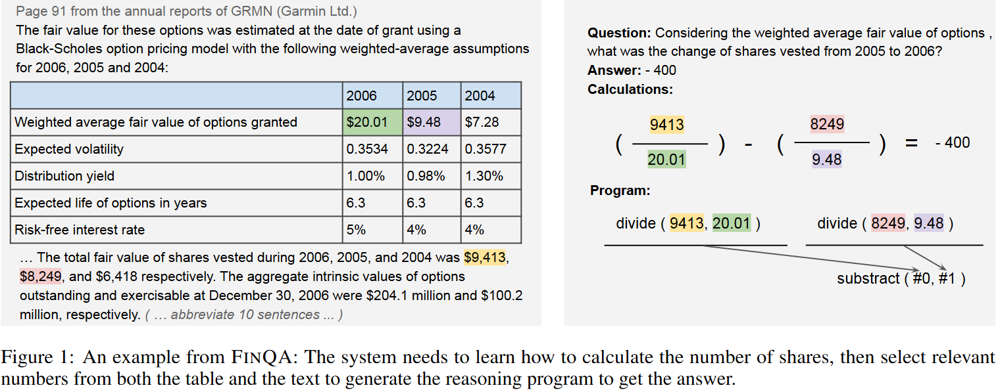
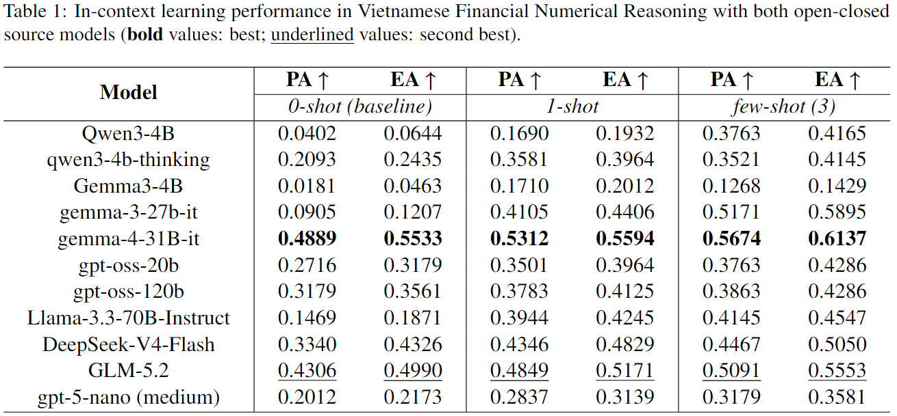
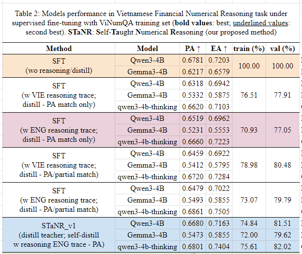
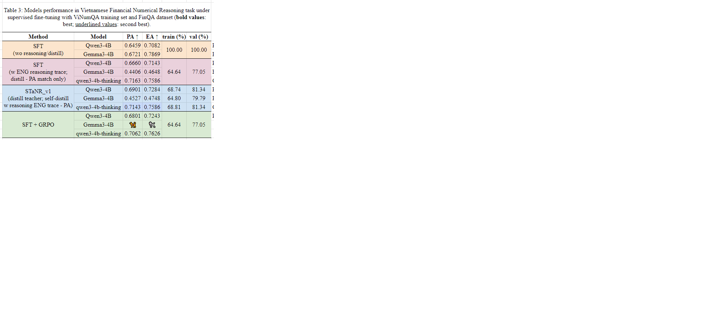

# NumReasoning4VietnameseFinancialText

Numerical reasoning question answering over Vietnamese financial documents,
built for the **VLSP 2025 Numerical Reasoning QA (NumQA)** shared task.

Given a financial document (text passages + a table) and a natural-language
question, the goal is to generate an executable **computation program** (a
sequence of arithmetic/table operators) that derives the correct numerical
answer — not just the answer itself. This makes every prediction auditable:
a wrong-but-lucky answer with a broken program is worth less than a
transparent, verifiable reasoning path.

## Task definition



- **Input**: `pre_text` (paragraphs before a table), `table`, `post_text`
  (paragraphs after), and a Vietnamese `question`.
- **Output**: a `program` string using 10 operators —
  `add`, `subtract`, `multiply`, `divide`, `exp`, `greater`,
  `table_sum`, `table_average`, `table_max`, `table_min` — where later steps
  can reference earlier results via `#0`, `#1`, etc.
  (e.g. `subtract(9829, 642), divide(#0, 642)`).
- **Metrics** (following the FinQA/VLSP 2025 protocol):
  - **Execution Accuracy (EA)** — does executing the program produce the
    gold numeric answer?
  - **Program Accuracy (PA)** — does the program structurally match the gold
    program (same operators/args/order, after normalization)? This is the
    stricter, primary metric for the task, since a correct-by-coincidence
    program is not actually trustworthy reasoning.

See `papers/` for the shared task description, the original FinQA paper this
task's format is based on, and a program-centric policy optimization paper
used as a reference for the SFT+GRPO stage.

## Dataset — ViNumQA (+ FinQA augmentation)

`datasets/ViNumQA/` and `datasets/FinQA/` are each organized by pipeline
stage — **see [`datasets/ViNumQA/README.md`](datasets/ViNumQA/README.md)
and [`datasets/FinQA/README.md`](datasets/FinQA/README.md) for the full
file-by-file breakdown**. Quick orientation:

```
datasets/ViNumQA/
├── origin/                      original train/valid/test/private_test splits
├── backward-rationale-distill/  superseded trace-distillation pipeline (kept for comparison)
├── distill-from-gemma-teacher/  current pipeline: independent-solve, teacher gemma-4-31B-it
└── self-distill/                STaNR: self-distillation from a model's own fine-tuned checkpoint
datasets/FinQA/                  same structure, used only as a training-set augmentation (see below)
```

`test.json` (in `origin/`) is the **fixed evaluation set for every result
below** — never used for training, validation, or filtering. `valid.json`
(also in `origin/`) is the validation set for every SFT run, whether the
training set is ViNumQA alone or ViNumQA+FinQA combined.

Each entry: `{pre_text, table, post_text, id, qa: {question, program, exe_ans}}`.
Unlike the original English FinQA, this dataset does **not** include a
`program_re` field (alternative valid programs for the same question), so no
program-diversity augmentation from that source is available here.

## Repository layout

```
notebooks/vinumqa/
├── 0-shot/                        0-shot prompting baselines
├── 1-shot/                        1-shot prompting baselines
├── few-shot/                      3-shot prompting baselines
├── distill-reasoning-trace/       teacher → reasoning-trace distillation (CoNR)
├── translate-reasoning-trace/     (abandoned) MT-based trace translation
├── sft-wo-reasoning-trace-distill/  QLoRA SFT, program-only labels (baseline)
├── sft-w-reasoning-trace-distill/   QLoRA SFT, distilled-reasoning-trace labels
└── sft-grpo/                      (planned) SFT + GRPO policy optimization stage
notebooks/evaluate/                shared PA/EA scorer (scorer.py)
notebooks/translated-finqa/        (placeholder) planned baselines on the translated-FinQA subset
datasets/ViNumQA/                  ViNumQA splits + distillation variants (see structure above)
datasets/FinQA/                    FinQA, used as a training-set augmentation for ViNumQA
papers/                            reference papers (task description, FinQA, PCPO)
```

**Every subdirectory above has its own `README.md`** with the per-notebook
breakdown — `notebooks/README.md` is the entry point into those; start there
for anything beyond a quick orientation. `datasets/README.md` /
`datasets/ViNumQA/README.md` cover the dataset variants in the same way.

Every prompting/SFT notebook shares the same `SYSTEM_MESSAGE` (operator list +
formatting rules), the same `pre_text`/`table`/`post_text`/`question` context
formatting (table rendered as GitHub-flavored markdown via `tabulate`), and
the same program parser/PA/EA scorer (`notebooks/evaluate/scorer.py`), so
results are directly comparable across models and methods.

## Methodology

### 1. Prompting baselines (0-shot / 1-shot / few-shot)

Zero, one, and three in-context examples, evaluated across multiple models
(local Qwen3-4B, API models via an OpenAI-compatible endpoint, and
`gpt-5-nano` via the OpenAI Batch API — 50% cheaper than sync calls, used
since these are offline full-test-set scoring runs rather than live serving).
The 1-shot exemplar is drawn from the VLSP 2025 paper's own Figure 1 example;
the 3 few-shot exemplars are hand-picked from `train.json`, one per evidence
category (Table Only / Text Only / Table & Text) matching the paper's own
question-type breakdown.

### 2. QLoRA SFT — no reasoning trace

`sft-wo-reasoning-trace-distill/qwen3-4b-stf-wo-reasoning-trace.ipynb`: fine-tunes
Qwen3-4B (4-bit + LoRA via Unsloth) to map context+question directly to the
gold program string, with loss masked to the assistant turn only
(`train_on_responses_only`). No synthesized or distilled reasoning trace —
this is the plain-label baseline to compare reasoning-augmented training
against.

### 3. Reasoning-trace distillation (CoNR) + SFT with reasoning

Rather than hoping the student model discovers good reasoning on its own, we
distill it from a stronger teacher, then fine-tune the student to produce
`{reasoning_trace}\n</think>\n\n{program}` instead of just `{program}`. Full
detail (prompt design, filters, sample counts) is in
[`notebooks/vinumqa/distill-reasoning-trace/README.md`](notebooks/vinumqa/distill-reasoning-trace/README.md)
and [`datasets/ViNumQA/README.md`](datasets/ViNumQA/README.md).

Two distillation pipelines were tried:

- **Backward rationalization (superseded)** — teacher `Qwen3-Next-80B-A3B-Thinking`
  is shown the gold program/answer and asked to write a trace that arrives
  at it. Reached 98–99% exact-match, but reading the traces end-to-end found
  ~1% leaked awareness of the answer despite denylist screening.
- **Independent-solve (current)** — teacher `gemma-4-31B-it` sees only
  context+question, no gold. A convention-hardened prompt (explicit rules
  against nested calls, unjustified rescaling, invented operators) raised
  exact-match from 14.4% to ~63%. Kept in 4 variants: Vietnamese/English ×
  PA-match-only/PA-partial-match filtering.

**SFT with reasoning** (`sft-w-reasoning-trace-distill/`, Qwen3-4B /
Qwen3-4B-Thinking-2507 / Gemma3-4B) trains on whichever variant
`DATASET_VARIANT` selects — see that folder's README.

### 4. STaNR — Self-Taught Numerical Reasoning (proposed)

After ordinary SFT on a teacher-distilled reasoning-trace set (SFT w ENG
trace, PA-match-only), the **fine-tuned checkpoint itself** is used as a
second-round teacher on exactly the samples the *original* teacher
(gemma-4-31B-it) failed to solve during independent-solve distillation. Only
self-generated traces whose program matches gold under PA are kept, then
merged back into the training set for one more SFT pass
(`sft-w-reasoning-trace-distill/qwen3-4b-self-distill-teacher-failed.ipynb`).

Two things worth calling out from getting this working:

- **Self-distillation from a model's own checkpoint is not inherently
  harmful.** An early run looked like a severe regression for one model,
  which raised a "self-loop confirmation bias" hypothesis — but that traced
  back to an evaluation bug (a `</think>` token-boundary split failing on
  ~39% of that checkpoint's outputs, leaking reasoning prose into the parsed
  program column) rather than a real modeling problem. Once fixed, and once
  self-distillation was applied uniformly (every model self-distilling from
  its *own* checkpoint, not cross-model), all three models improved over
  their PA-match-only baseline.
- **Majority-of-k voting on the self-distillation step helps further.**
  Sampling 5 independent generations per teacher-failed sample and keeping
  the modal program (first-generation as tiebreak) — rather than a single
  generation — plausibly filters out "right answer via unsound reasoning"
  cases that a bare PA-match filter alone doesn't catch (found by manually
  reading the self-distilled traces: a sample can land on the correct
  `table_max` call by hedging/coincidence rather than understanding why it
  applies, and still pass PA).

A second combined training set (`STaNR_v1` in Table 3 below) extends the
teacher-verified pool and the self-distillation candidate pool to
**ViNumQA + FinQA** together (FinQA reformatted to ViNumQA's schema — see
`datasets/FinQA/formating_datasets.ipynb`), instead of ViNumQA alone.

### 5. SFT + GRPO (planned)

`notebooks/vinumqa/sft-grpo/` — reward function combining program validity,
execution correctness, and conciseness (following the program-centric policy
optimization approach in `papers/`), to further refine the SFT model beyond
supervised imitation. Not yet implemented.

## Results (test.json, 497 samples)

### In-context learning results



Best in-context result so far: **gemma-4-31B-it, few-shot (3)** — PA 0.5674 / EA 0.6137.

### Fine-tuned — ViNumQA training set



`train (%)` / `val (%)`: how much of the original ViNumQA train/valid split
the reasoning-trace training set actually covers (rows without a verified
distilled trace are dropped for the PA-match-only/STaNR rows, so these are
below 100% — only the no-reasoning baseline trains on every sample).
`STaNR_v1` here self-distills each model from its own SFT-w-ENG-trace
checkpoint (see Methodology §4); qwen3-4b-thinking's row uses majority-of-5
voting on the self-distillation step, the other two use a single generation
per sample.

### Fine-tuned — ViNumQA + FinQA combined training set



Same setup, but both the teacher-verified pool and the STaNR self-distillation
candidate pool (teacher-failed samples) are drawn from ViNumQA **and** FinQA
together, reformatted to a shared schema (`datasets/FinQA/formating_datasets.ipynb`).
VIE-trace and PA/partial-match variants were dropped from this table — prior
experiments (above) already showed ENG trace outperforms VIE, and PA/partial
match risks training on a trace that doesn't match its own program's exact
surface form. qwen3-4b-thinking's STaNR row and Gemma3-4B's PA/EA are still
running as of this writing.

PA/EA are computed with the shared evaluator in `notebooks/evaluate/scorer.py`
(sympy-based symbolic Program Accuracy, table-row-lookup-aware Execution
Accuracy, ported from the official FinQA evaluation protocol), so all rows
in both tables are directly comparable — including across tables, since the
evaluation set (`test.json`) is identical in both.

## Running the notebooks

Most notebooks are self-contained: they resolve the project root by walking
up to the nearest `.git` directory, so they can be run from either the repo
root or the notebook's own folder without path edits.

- **API-based prompting notebooks** (0/1/few-shot, non-batch): need `API_KEY`
  and `BASE_URL` in a `.env` file at the project root (OpenAI-compatible
  endpoint).
- **Batch API notebooks** (`*-gpt5nano-batch.ipynb`): need `OPENAI_API_KEY`
  (a real OpenAI account key — Batch API is not available on third-party
  proxy endpoints).
- **Local-model notebooks** (Qwen3-4B, Qwen3-4B-Thinking-2507, Gemma3-4B,
  Qwen3-Next-80B): designed to run on Kaggle (free T4/P100 tier, 12h session
  limit — train/eval are split into separate notebooks where a combined run
  would exceed it) or Modal (`-modal.ipynb` variants; Qwen3-Next-80B needs
  ≥160GB VRAM — see the trace-gen notebook's intro cell for the specific GPU
  config and vLLM flags needed on Blackwell-generation GPUs).

`.env` and all `outputs/`/intermediate-artifact directories are gitignored;
see `.gitignore` for the exact excluded paths.

## Acknowledgments

Built as part of the VLSP 2025 NumQA shared task submission. See `papers/`
for the shared task paper (dataset construction, evaluation protocol, and a
survey of top-performing teams' methods) and the FinQA/PCPO papers this
work's format and SFT+GRPO design are based on.
